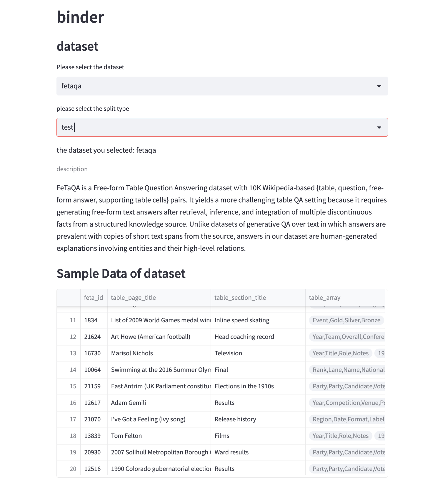
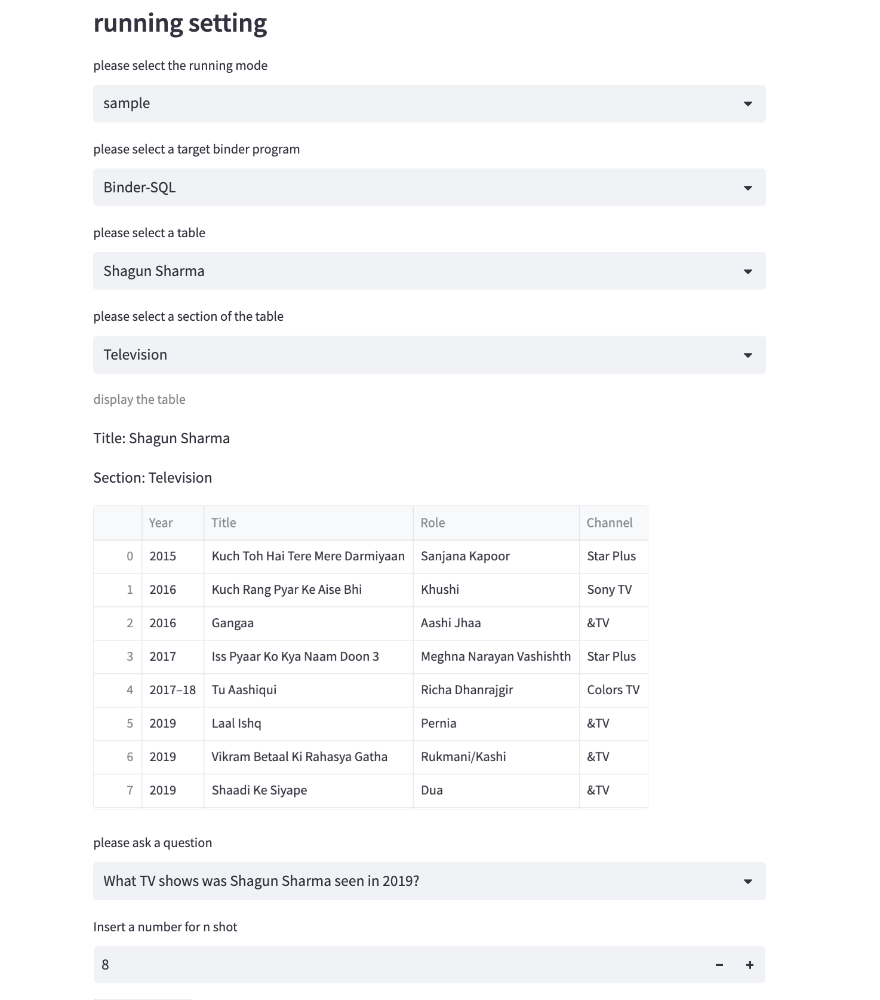
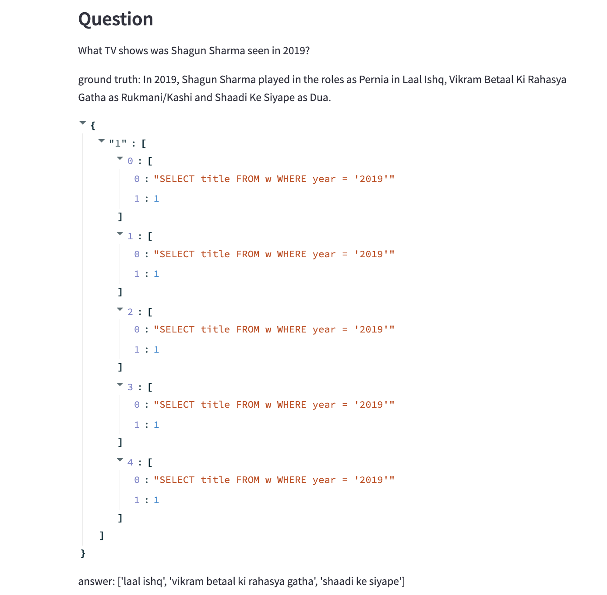
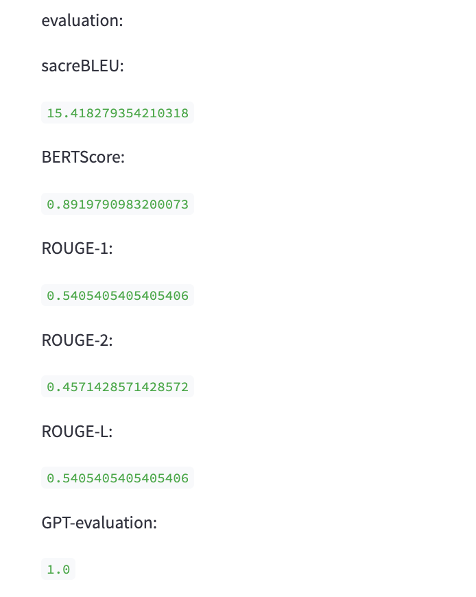
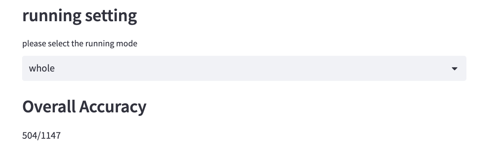
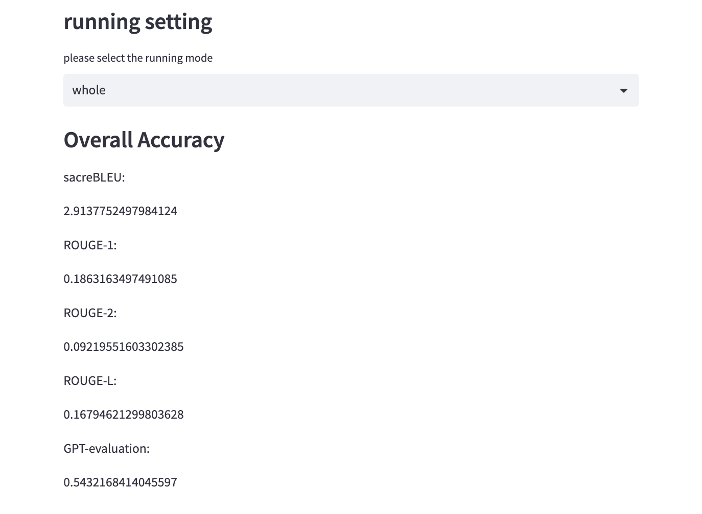

# Trail Test 01

## Task description
The task is table question-answering (Table QA). The input is a table and a question related to the table, the output is the answer that needs deep reasoning. 

Dataset: There are two table question-answering datasets. 
1. Wikipedia domain: FetaQA dataset. 
* Paper: https://arxiv.org/abs/2104.00369
2. Financial domain: FinQA dataset. 
* Paper: https://arxiv.org/pdf/2109.00122.pdf
 
Model: BINDER: Binding Language Models in Symbolic Languages, ICLR’23. 
* Paper: https://arxiv.org/abs/2210.02875
* Codebase: https://github.com/xlang-ai/Binder

Goal: The goal is to learn and understand the paper and codebase of the Binder model, apply it to the FetaQA and FinQA datasets, and test the Binder model’s accuracy in the FetaQA and FinQA datasets. 


## Dependencies
To establish the environment run this code in the shell:
```bash
conda create -n binder python=3.7
conda activate binder
pip install -r requirements.txt
```
That will create the environment `binder` we used.


## Usage

### Environment setup
Activate the environment by running
``````shell
conda activate binder
``````

### Add key
Apply and get `API keys`(sk-xxxx like) from [OpenAI API](https://openai.com/api/), save the key in `key.txt` file, make sure you have the rights to access the model(in the implementation of this repo, `code-davinci-002`) you need.

### Run
1. Visualization Mode
``````shell
streamlit run front.py
``````
2. Non-Visualization Mode
    
    Check out commands in `run.py`

## Visualization




## Results
### finqa

### fetaqa


